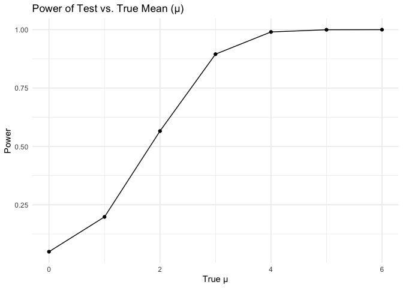
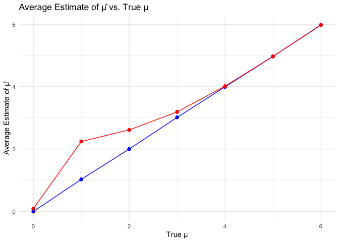

p8105_hw5_rkk2139.Rmd
================
Riya Kalra
2024-11-11

``` r
# Set parameters
n <- 30
sigma <- 5
mu_values <- 0:6
alpha <- 0.05
n_simulations <- 5000

#step 3
simulate_power <- function(mu) {
  results <- replicate(n_simulations, {
    # Generate data with specified mean
    data <- rnorm(n, mean = mu, sd = sigma)
    
    # Perform one-sample t-test and tidy the output
    test <- t.test(data, mu = 0)
    result <- tidy(test)
    
    # Extract mean estimate and p-value
    c(mu_hat = result$estimate, p_value = result$p.value)
  })
  
  # Convert to data frame
  results_df <- as.data.frame(t(results))
  colnames(results_df) <- c("mu_hat", "p_value")
  results_df
}

#Step 4

# Run simulations across all specified mu values
simulation_results <- lapply(mu_values, function(mu) {
  results_df <- simulate_power(mu)
  results_df$true_mu <- mu
  results_df
}) %>% bind_rows()

summary_results <- simulation_results %>%
  group_by(true_mu) %>%
  summarize(
    power = mean(p_value < alpha),
    avg_mu_hat = mean(mu_hat),
    avg_mu_hat_rejected = mean(mu_hat[p_value < alpha])
  )

# Plot power vs true mean
ggplot(summary_results, aes(x = true_mu, y = power)) +
  geom_line() +
  geom_point() +
  labs(title = "Power of Test vs. True Mean (µ)",
       x = "True µ",
       y = "Power") +
  theme_minimal()
```

<!-- -->

``` r
#Plot avg estimate of mu hat
ggplot(summary_results, aes(x = true_mu)) +
  geom_line(aes(y = avg_mu_hat), color = "blue") +
  geom_point(aes(y = avg_mu_hat), color = "blue", size = 2) +
  geom_line(aes(y = avg_mu_hat_rejected), color = "red") +
  geom_point(aes(y = avg_mu_hat_rejected), color = "red", size = 2) +
  labs(title = "Average Estimate of µ̂ vs. True µ",
       x = "True µ",
       y = "Average Estimate of µ̂") +
  theme_minimal() +
  scale_color_manual(values = c("blue" = "Overall µ̂", "red" = "Rejected µ̂"))
```

    ## Warning: No shared levels found between `names(values)` of the manual scale and the
    ## data's colour values.

<!-- -->
