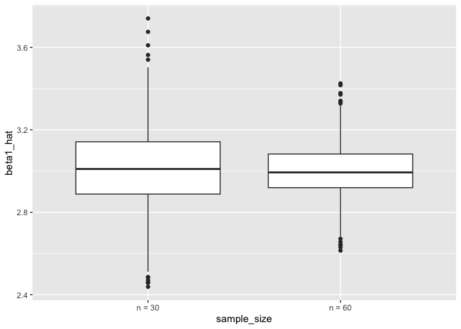

p8105_hw5_rkk2139.Rmd
================
Riya Kalra
2024-11-12

# Problem 2

``` r
# Set parameters
n <- 30
sigma <- 5
mu_values <- 0:6
alpha <- 0.05
n_simulations <- 5000

# Step 3
simulate_power <- function(mu) {
  results <- replicate(n_simulations, {
    # Generate data with specified mean
    data <- rnorm(n, mean = mu, sd = sigma)
    
    # Perform one-sample t-test and tidy the output
    test <- t.test(data, mu = 0)
    result <- tidy(test)
    
    # Extract mean estimate and p-value
    c(mu_hat = result$estimate, p_value = result$p.value)
  })
  
  # Convert to data frame
  results_df <- as.data.frame(t(results))
  colnames(results_df) <- c("mu_hat", "p_value")
  results_df
}

#Step 4

# Run simulations across all specified mu values
simulation_results <- lapply(mu_values, function(mu) {
  results_df <- simulate_power(mu)
  results_df$true_mu <- mu
  results_df
}) %>% bind_rows()

summary_results <- simulation_results %>%
  group_by(true_mu) %>%
  summarize(
    power = mean(p_value < alpha),
    avg_mu_hat = mean(mu_hat),
    avg_mu_hat_rejected = mean(mu_hat[p_value < alpha])
  )
```

``` r
# Plot power vs true mean
ggplot(summary_results, aes(x = true_mu, y = power)) +
  geom_line() +
  geom_point() +
  labs(title = "Power of Test vs. True Mean (µ)",
       x = "True µ",
       y = "Power") +
  theme_minimal()
```

<!-- -->

The power of the test is the probability of correctly rejecting the null
hypothesis when there is a true effect. As the true mean μ increases,
the power of the test also increases. This means that larger effect
sizes lead to a higher probability of rejecting the null hypothesis, or
detecting a true effect. This increase in power with effect size occurs
because a larger true mean shifts the distribution of sample means
further away from the hypothesized mean of zero. This makes it easier
for the test to identify a significant difference, resulting in higher
power.

There is a positive association between effect size and power: as the
true effect size increases, the power of the test also increases.

``` r
#Plot avg estimate of mu hat
ggplot(summary_results, aes(x = true_mu)) +
  geom_line(aes(y = avg_mu_hat), color = "blue") +
  geom_point(aes(y = avg_mu_hat), color = "blue", size = 2) +
  geom_line(aes(y = avg_mu_hat_rejected), color = "red") +
  geom_point(aes(y = avg_mu_hat_rejected), color = "red", size = 2) +
  labs(title = "Average Estimate of µ̂ vs. True µ",
       x = "True µ",
       y = "Average Estimate of µ̂") +
  theme_minimal() +
  scale_color_manual(values = c("blue" = "Overall µ̂", "red" = "Rejected µ̂"))
```

    ## Warning: No shared levels found between `names(values)` of the manual scale and the
    ## data's colour values.

<!-- -->

In the plot of all samples, the average estimate of μ across samples
aligns closely with the true value of μ^, which is expected due to the
properties of the sampling distribution. However, in the plot of samples
where the null hypothesis was rejected, the average estimate of μ^ tends
to be slightly higher than the true μ.

Therefore the sample sample average of μ^ across tests for which the
null is rejected is NOT approximately equal to the true value of μ. In
cases where the null hypothesis is rejected, the estimated μ^ is more
likely, on average, to be further from zero than those estimates that do
not lead to rejection. This creates a selection bias where only larger
observed effects pass the threshold for significance, resulting in a
slight overestimation of μ in the subset where the null was rejected.

# Problem 3

Description of raw data:

The dataset contains information about homicides in large U.S. cities.
Here are some key variables based on the visible columns in the
screenshot:

uid: Unique identifier for each homicide case. reported_date: Date the
homicide was reported, in YYYYMMDD format. last_name and first_name:
Name of the homicide victim. race: Victim’s race. victim_age: Age of the
victim. sex: Victim’s sex. city and state: City and state where the
homicide occurred. lat and lon: Latitude and longitude coordinates of
the homicide location. disposition: Outcome of the case (e.g., “Closed
by arrest”, “Closed without arrest”, “Open/No arrest”).

``` r
homicide_data <- read_csv("data/homicide-data.csv")
```

    ## Rows: 52179 Columns: 12
    ## ── Column specification ────────────────────────────────────────────────────────
    ## Delimiter: ","
    ## chr (9): uid, victim_last, victim_first, victim_race, victim_age, victim_sex...
    ## dbl (3): reported_date, lat, lon
    ## 
    ## ℹ Use `spec()` to retrieve the full column specification for this data.
    ## ℹ Specify the column types or set `show_col_types = FALSE` to quiet this message.

``` r
# Clean data
homicide_data <- homicide_data %>%
  rename(
    last_name = victim_last,
    first_name = victim_first,
    race = victim_race,
    sex = victim_sex
  ) %>%
  
  mutate(
    first_name = str_to_title(first_name),
    last_name = str_to_title(last_name)
  )

# Create variable

homicide_data <- homicide_data %>%
  # Create city_state variable by combining city and state
  mutate(city_state = str_c(city, ", ", state)) %>%
  # Summarize data within each city_state
  group_by(city_state) %>%
  summarize(
    total_homicides = n(),
    unsolved_homicides = sum(disposition %in% c("Closed without arrest", "Open/No arrest"))
  )

# View the summarized data
print(homicide_data)
```

    ## # A tibble: 51 × 3
    ##    city_state      total_homicides unsolved_homicides
    ##    <chr>                     <int>              <int>
    ##  1 Albuquerque, NM             378                146
    ##  2 Atlanta, GA                 973                373
    ##  3 Baltimore, MD              2827               1825
    ##  4 Baton Rouge, LA             424                196
    ##  5 Birmingham, AL              800                347
    ##  6 Boston, MA                  614                310
    ##  7 Buffalo, NY                 521                319
    ##  8 Charlotte, NC               687                206
    ##  9 Chicago, IL                5535               4073
    ## 10 Cincinnati, OH              694                309
    ## # ℹ 41 more rows
